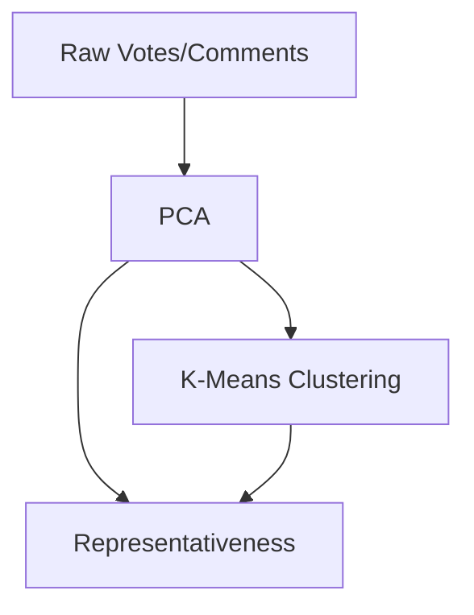
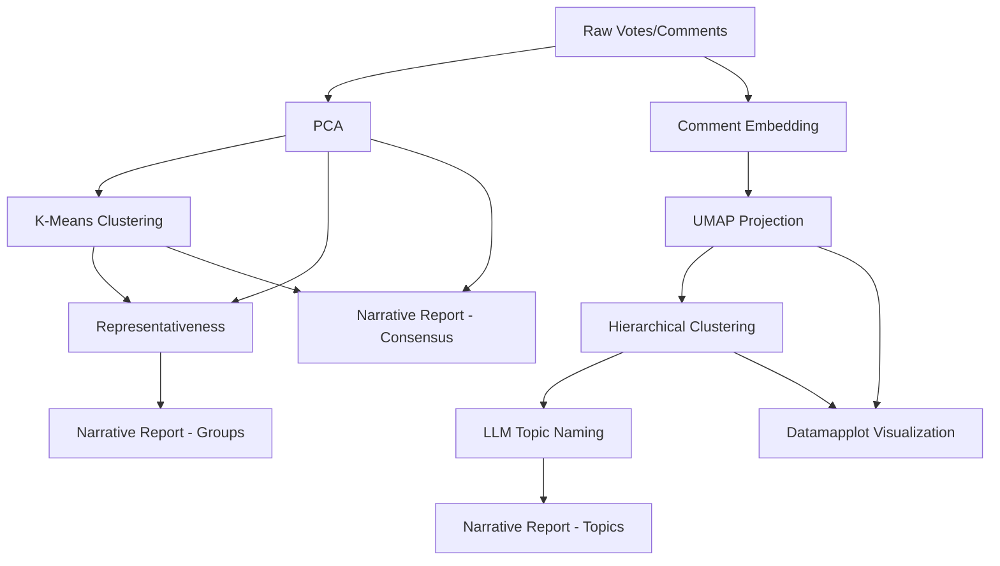

# Delphi Job System Design

## Overview

This document outlines the design for the Delphi Job System, a modular and dependency-driven approach to processing Polis conversations. The system is designed to:

1. Provide fine-grained control over which processing steps run
2. Enable efficient batch processing across conversations
3. Optimize resource usage, particularly for expensive operations
4. Support both fully-automated and partially-manual workflows

## Core Design Principle

The core principle is to make processing **explicit rather than implicit**. No expensive operations should run by default; they must be explicitly requested.

## Job Structure

A job is defined by:

- `job_id`: Unique identifier
- `conversation_id`: The conversation to process
- `job_type`: A shorthand for pre-defined workflows (e.g., `MATH_ONLY`, `FULL_PIPELINE`)
- `stages`: The specific processing stages to execute

## Dependency Graph

The system is built around a directed acyclic graph (DAG) of dependencies. Each node in the graph represents a processing stage, and edges represent dependencies between stages.

### Core Processing Stages



### Extended Processing Stages



## Stage Definitions

| Stage | Description | Dependencies | Resource Intensity |
|-------|-------------|--------------|-------------------|
| `PCA` | Principal Component Analysis on vote matrix | None | Medium |
| `KMEANS_CLUSTERING` | Cluster participants | `PCA` | Low |
| `REPRESENTATIVENESS` | Calculate comment representativeness | `PCA`, `KMEANS_CLUSTERING` | Low |
| `COMMENT_EMBEDDING` | Generate embeddings for comments | None | Medium |
| `UMAP_PROJECTION` | Create UMAP projection | `COMMENT_EMBEDDING` | Medium |
| `HIERARCHICAL_CLUSTERING` | Cluster comments | `UMAP_PROJECTION` | Low |
| `LLM_TOPIC_NAMING` | Name topics using LLM | `HIERARCHICAL_CLUSTERING` | High (tokens) |
| `DATAMAPPLOT_VISUALIZATION` | Generate visualizations | `UMAP_PROJECTION`, `HIERARCHICAL_CLUSTERING` | Medium |
| `NARRATIVE_REPORT_CONSENSUS` | Generate consensus narrative | `PCA`, `KMEANS_CLUSTERING` | High (tokens) |
| `NARRATIVE_REPORT_GROUPS` | Generate group narrative | `PCA`, `KMEANS_CLUSTERING`, `REPRESENTATIVENESS` | High (tokens) |
| `NARRATIVE_REPORT_TOPICS` | Generate topic narrative | `HIERARCHICAL_CLUSTERING`, `LLM_TOPIC_NAMING` | High (tokens) |

## Implementation

### Job Queue Schema

The job queue should store:

1. Job metadata (ID, creation time, status)
2. The requested stages with their enabled status
3. Job results and errors

```typescript
interface DelphiJob {
  job_id: string;
  conversation_id: string;
  job_type: "CUSTOM" | "MATH_ONLY" | "FULL_PIPELINE" | string;
  status: "PENDING" | "PROCESSING" | "COMPLETED" | "FAILED";
  created_at: string;
  updated_at: string;
  worker_id: string;
  stages: {
    stage: string;
    enabled: boolean;
  }[];
  logs: {
    entries: {
      timestamp: string;
      level: string;
      message: string;
    }[];
  };
  job_results: any;
  version: number;
}
```

### Job Processing Logic

The job processor should:

1. Validate the job configuration
2. Build a dependency graph from enabled stages
3. Topologically sort the graph to determine execution order
4. Execute each stage, checking that dependencies were successful
5. Update job status and results after each stage

### Configuration Management

Configuration should be kept separate from the dependency graph. The system should:

1. Define the graph structure as a fixed, code-defined entity
2. Accept stage-specific configuration as optional parameters
3. Provide sensible defaults for all configuration values
4. Support environment variable overrides for global settings

## Pre-defined Job Types

For convenience, several pre-defined job types can be offered:

| Job Type | Enabled Stages | Use Case |
|----------|---------------|----------|
| `MATH_ONLY` | `PCA`, `KMEANS_CLUSTERING`, `REPRESENTATIVENESS` | Basic math pipeline |
| `EMBEDDING_BATCH` | `COMMENT_EMBEDDING` | Process new comments |
| `VISUALIZATION_UPDATE` | `DATAMAPPLOT_VISUALIZATION` | Update visualizations |
| `TOPIC_GENERATION` | `HIERARCHICAL_CLUSTERING`, `LLM_TOPIC_NAMING` | Generate topics |
| `NARRATIVE_UPDATE` | All narrative report stages | Update all narratives |
| `FULL_PIPELINE` | All stages | Complete processing |

## Benefits

This architecture provides several key benefits:

1. **Resource Optimization**: Only run what's needed, reducing computation and token costs
2. **Selective Updates**: Update specific parts of the analysis without redoing everything
3. **Batch Processing**: Group similar operations (like embeddings) across conversations
4. **Resilience**: Failure in one stage doesn't necessarily fail the entire job
5. **Flexibility**: Easy to add new stages or change dependencies without breaking existing code
6. **Observability**: Clear tracking of which stages have run and their status

## Future Extensions

The system can be extended to support:

1. Job priorities and scheduling
2. Retry policies for failed stages
3. Stage-specific timeouts
4. Resource allocation based on stage requirements
5. Parallel execution of independent stages
6. Progress reporting for long-running stages

## Implementation Plan

1. Define the DAG structure in code
2. Implement the topological sort algorithm
3. Create stage execution handlers
4. Integrate with the existing job poller
5. Add job type presets
6. Implement logging and error handling
7. Create job submission API endpoints

## Conclusion

By designing the job system around a clean dependency graph rather than specific configurations, we create a flexible, maintainable system that can evolve as requirements change. The explicit nature of job definitions ensures resource efficiency while providing fine-grained control over the processing pipeline.